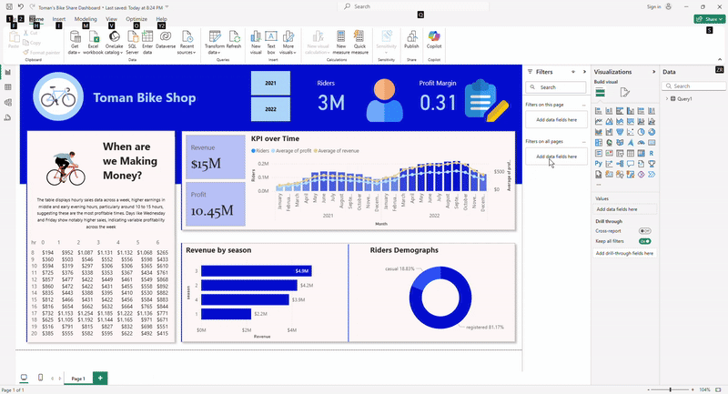

# 🚴‍♂️ Toman Bike Share Analytics Dashboard

A complete data analysis project using **Power BI**, **SQL**, and **Excel** to uncover business insights and support strategic decision-making for a fictional bike-sharing service, *Toman Bike Share*.

---

## 📊 Dashboard Overview

The project delivers an interactive Power BI dashboard analyzing:

- ⏰ **Hourly Revenue & Peak Usage Times**
- 📈 **Profit & Revenue Trends**
- 🍂 **Seasonal Patterns**
- 👥 **Rider Demographics (Casual vs. Registered)**
- 💡 **Actionable Pricing Recommendations**

---

## 🧩 Tools & Technologies

- **Power BI** – Data visualization and dashboard creation  
- **SQL** – Database creation, querying, and analysis  
- **Excel** – Initial data cleaning and preprocessing  

---

## 🛠️ Project Workflow

1. **Data Preparation**  
   - Created a synthetic database structure to simulate business data  
   - Cleaned and transformed raw data using Excel and SQL

2. **Data Analysis (SQL)**  
   - Queried key metrics: revenue, profit, usage by time/day, user segmentation

3. **Dashboard Development (Power BI)**  
   - Connected SQL database to Power BI  
   - Built interactive visuals using company branding

4. **Business Insights & Strategy**  
   - Recommended a **10–15% price increase** based on trends  
   - Proposed a **segmented pricing model** for different user types

---

## 📷 Sample Dashboard Preview

> _📌 Add a screenshot or GIF of your Power BI dashboard here_  
> *(Example below — replace with your actual image)*

---

## 📈 Key Insights

- Peak usage observed during weekends and evenings
- Registered users contribute higher recurring revenue
- Seasonal dips during winter months, suggesting promo opportunities
- Conservative price adjustment recommended to maintain demand

---

## 📎 Recommendations

- Implement segmented pricing for casual and registered users  
- Monitor customer response post-pricing change  
- Conduct user satisfaction surveys to refine future strategies

---

## 🧠 What I Learned

- Building end-to-end BI solutions from raw data to insights  
- Visual storytelling using Power BI  
- Data-driven decision-making and strategic analysis  
- Designing for usability and executive communication

---

## 🚀 How to Explore the Project

1. Clone the repository  
2. Open `.pbix` file in Power BI Desktop  
3. Review SQL queries in `/SQL/` folder  
4. Sample dataset and schema available in `/Data/`

---

## 📷 Dashboard Demo

---

## 📬 Contact

**[Kaif Sayed]**  
📧 kaifsdkpro2@gmail.com 
📎 [LinkedIn](https://www.linkedin.com/in/kaif-sayed-ab8405253/) 

---

⭐ *If you like this project, feel free to star it or share feedback!*
